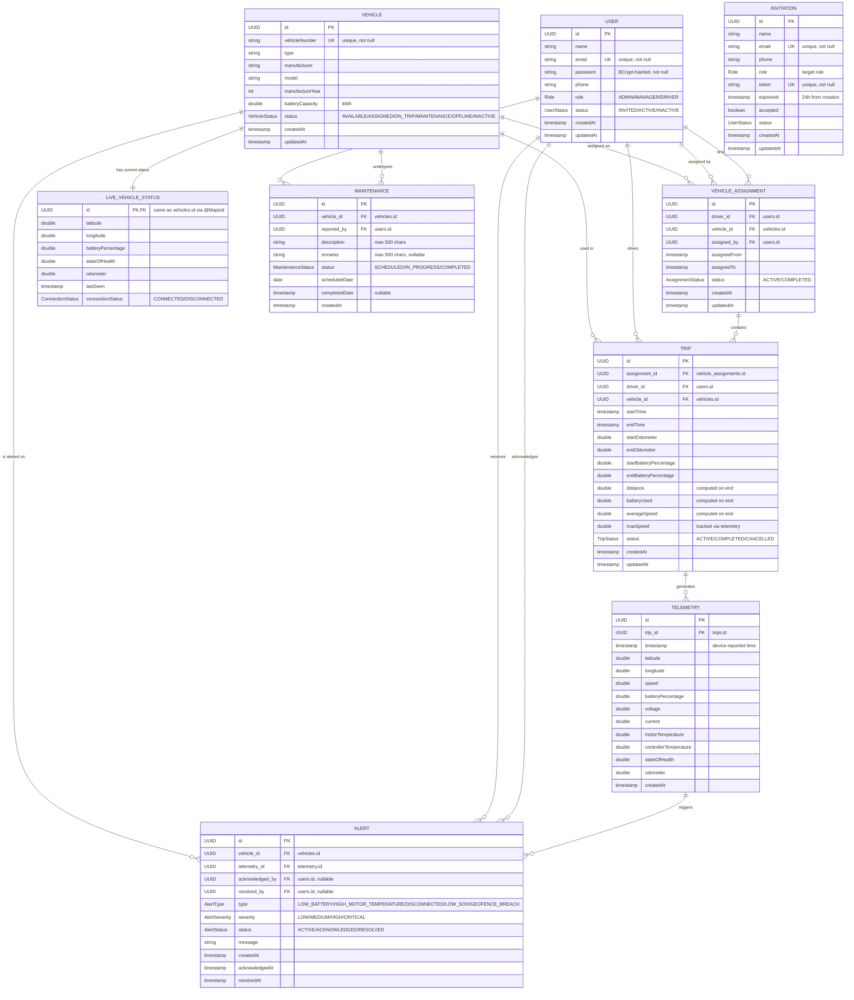

# Fleet Management & Telemetry Platform

A production-style **Spring Boot backend** for managing Electric Vehicle (EV) fleets — covering user management, vehicle registration, driver assignments, trip lifecycle tracking, real-time ESP32 telemetry ingestion, intelligent alert generation, and maintenance workflows.

The system is built for organizations that operate connected EV fleets. Vehicles carry **ESP32-based IoT devices** that periodically stream telemetry (GPS, battery, motor temperature, voltage, current, state of health) to the backend over HTTP. The platform stores this data, maintains live vehicle status, automatically triggers operational alerts, and exposes secure REST APIs for **Admins**, **Managers**, and **Drivers**.

---

## Table of Contents

1. [Features](#features)
2. [Technology Stack & Justification](#technology-stack--justification)
3. [System Architecture](#system-architecture)
4. [Project Structure](#project-structure)
5. [Database Design](#database-design)
6. [Business Workflows](#business-workflows)
7. [Security & Role-Based Access Control](#security--role-based-access-control)
8. [Complete API Reference](#complete-api-reference)
9. [Exception Handling](#exception-handling)
10. [Getting Started](#getting-started)
11. [ESP32 Telemetry Integration](#esp32-telemetry-integration)
12. [Environment Configuration](#environment-configuration)
13. [Docker Support](#docker-support)
14. [Development Roadmap](#development-roadmap)
15. [Future Enhancements](#future-enhancements)

---

## Features

### Authentication & Authorization
- JWT (JSON Web Token) based stateless authentication
- Spring Security integration
- BCrypt password hashing
- Role-Based Access Control (RBAC) with three roles
- Method-level security via `@PreAuthorize`

**Roles:** `ADMIN`, `MANAGER`, `DRIVER`

### User Management
- Admin-only CRUD operations for all users
- Email invitation flow with secure token-based activation
- Invitation expiry (24 hours)
- User status lifecycle: `INVITED → ACTIVE → INACTIVE`

### Vehicle Management
- Register/update/query vehicles by ID or vehicle number
- Track battery capacity and manufacturing details
- Vehicle status lifecycle: `AVAILABLE → ASSIGNED → ON_TRIP → MAINTENANCE → OFFLINE`

### Vehicle Assignment
- Assign available vehicles to active drivers
- Track who assigned the vehicle and when
- Automatic vehicle status transitions on assign/unassign

### Trip Management
- Drivers start and end trips using the vehicle assigned to them
- Automatic trip analytics on completion:
  - Distance travelled
  - Battery consumed
  - Average speed
  - Max speed (tracked from telemetry)
- Vehicle status transitions: `ASSIGNED → ON_TRIP → ASSIGNED`

### Telemetry Processing
- Ingestion endpoint for ESP32 devices (`POST /api/telemetry`)
- Stores full historical telemetry for every trip
- Updates the `live_vehicle_status` table in real-time
- Tracks maximum speed per trip
- Triggers the **Alert Engine** automatically

### Live Vehicle Monitoring
- Dedicated denormalized table storing only the *latest* state of each vehicle
- Fast dashboard queries without scanning millions of telemetry rows
- Connection status tracking (`CONNECTED` / `DISCONNECTED`)

### Intelligent Alert Engine
Automatically evaluated on every telemetry packet:

| Alert Type | Threshold |
|---|---|
| `LOW_BATTERY` | Battery < 20% |
| `HIGH_MOTOR_TEMPERATURE` | Motor temp > 80°C |
| `LOW_SOH` | State of Health < 20% |
| `GEOFENCE_BREACH` | Coordinates outside geofence |
| `DISCONNECTED` | No telemetry for > 5 minutes |

- Duplicate active alerts are prevented (one active alert per type per vehicle)
- Full alert lifecycle: `ACTIVE → ACKNOWLEDGED → RESOLVED`
- Filter alerts by vehicle, telemetry, status, type, severity, or any combination

### Maintenance Management
- Schedule maintenance for a vehicle
- Track lifecycle: `SCHEDULED → IN_PROGRESS → COMPLETED`
- Store service remarks and completion timestamps

### Email Notifications
- SMTP-based invitation emails with activation tokens (via Gmail)

### API Documentation
- Auto-generated Swagger UI (`/swagger-ui.html`)
- OpenAPI 3.0 specification (`/v3/api-docs`)

### Production Monitoring
- Spring Boot Actuator endpoints (`/actuator/health`)
- Hikari connection pool tuning
- SQL logging with Hibernate formatting

---

## Technology Stack & Justification

| Technology | Version | Purpose | Why It Was Used |
|---|---|---|---|
| **Java** | 17 | Language | LTS (Long-Term Support) release — stable, widely adopted, supports modern features (records, sealed classes, switch expressions), and provides 8+ years of vendor support. Runs on a mature JVM with excellent performance. |
| **Spring Boot** | 3.5.16 | Framework | Convention-over-configuration framework that auto-configures the entire application context. Embedded Tomcat server removes the need for external server deployment. Massive ecosystem and industry-standard for Java REST backends. |
| **Spring Web MVC** | 3.5.16 | REST layer | Provides `@RestController`, `@RequestMapping`, path variables, request/response binding, and content negotiation. Battle-tested HTTP stack. |
| **Spring Data JPA (Hibernate)** | 3.5.16 | ORM / Persistence | Eliminates hand-written SQL for CRUD operations via repository interfaces. Entity classes map directly to database tables with `ddl-auto=update` for automatic schema generation. Hibernate is the industry-standard ORM with caching and relationship handling. |
| **PostgreSQL** | — | Database | Open-source, ACID-compliant relational database. Supports `UUID` natively (used for all primary keys), `ENUM`-like storage via strings, excellent JSON support (useful for future telemetry extensions), and robust geospatial extensions (PostGIS) which align with the telemetry/GPS use case. Hosted on **Neon** (serverless Postgres) for cloud deployment. |
| **Spring Security** | 3.5.16 | Authentication / Authorization | De-facto standard for Java security. Provides filter chains, `SecurityContext`, method-level security (`@PreAuthorize`), and seamless integration with the JWT filter. |
| **JWT (jjwt 0.11.5)** | 0.11.5 | Token authentication | Stateless authentication — no session storage required, scales horizontally across instances. Tokens embed user claims (email, role) and are verified via HMAC-SHA256 signature. |
| **BCrypt** | — | Password hashing | Industry-standard salted password hashing algorithm. Resistant to brute-force and rainbow-table attacks; each hash includes a random salt. |
| **Jakarta Bean Validation** | — | Input validation | Declarative DTO validation (`@NotNull`, `@Email`, `@DecimalMin`, `@Positive`, etc.) executed before service logic, preventing invalid data from reaching the database. |
| **Lombok** | — | Boilerplate reduction | Generates getters/setters/builders/constructors at compile time, drastically reducing entity/DTO boilerplate while keeping code readable. |
| **springdoc-openapi** | 2.0.2 | API documentation | Auto-generates OpenAPI 3.0 spec and Swagger UI from Spring annotations — zero documentation maintenance overhead, interactive API testing built-in. |
| **Spring Boot Actuator** | 3.5.16 | Production monitoring | Exposes health checks (`/actuator/health`) used by Docker/orchestrators for readiness/liveness probes. |
| **Spring Boot Starter Mail** | — | Email services | Sends invitation emails with activation tokens via Gmail SMTP. Uses `JavaMailSender` abstraction. |
| **HikariCP** | — | Connection pooling | Default Spring Boot pool. Tuned in `application.properties` (max 10 connections, min 5 idle, 30s timeout) for performance under concurrent fleet traffic. |
| **Maven** | 3.9+ | Build tool | Standard Java build lifecycle — dependency management, packaging, testing. Works with Maven wrapper (`mvnw`) for zero-install builds. |
| **Docker** | — | Containerization | Multi-stage Dockerfile (build with Maven wrapper → slim JDK runtime image) enables one-command deployment to any cloud. |
| **Spring Boot DevTools** | — | Development | Automatic restart on code changes to speed up development iteration. |

---

## System Architecture

```
                        ┌──────────────────────────────────────────────┐
                        │        Client Applications (Web/Mobile)      │
                        ├──────────────────────────────────────────────┤
                        │   • Admin / Manager Dashboard                │
                        │   • Driver Mobile App                        │
                        │   • Postman / cURL / Swagger UI              │
                        └───────────────────┬──────────────────────────┘
                                            │  HTTPS + JWT Bearer Token
                                            ▼
                        ┌──────────────────────────────────────────────┐
                        │             Spring Security                  │
                        │         JwtAuthFilter (OncePerRequest)       │
                        │     • Validates token signature & expiry     │
                        │     • Loads user + ROLE into SecurityContext │
                        │     • Rejects unauthenticated requests       │
                        └───────────────────┬──────────────────────────┘
                                            ▼
                        ┌──────────────────────────────────────────────┐
                        │              Controllers Layer               │
                        │    @RestController • @Valid • @PreAuthorize  │
                        │   • Maps HTTP → DTOs • Handles status codes  │
                        └───────────────────┬──────────────────────────┘
                                            ▼
                        ┌──────────────────────────────────────────────┐
                        │              Services Layer                  │
                        │    @Service • @Transactional • Business Logic│
                        │   • Auth, Trip, Telemetry, Alert Engine,     │
                        │     Invitation, Assignment, Maintenance      │
                        └───────────────────┬──────────────────────────┘
                                            ▼
                        ┌──────────────────────────────────────────────┐
                        │            Repository Layer (JPA)            │
                        │        Spring Data JPA interfaces            │
                        │   Derived queries + custom finders           │
                        └───────────────────┬──────────────────────────┘
                                            ▼
                        ┌──────────────────────────────────────────────┐
                        │     PostgreSQL Database (Neon Cloud)         │
                        │  9 tables: users, vehicles, assignments,     │
                        │  trips, telemetry, live_vehicle_status,      │
                        │  alerts, invitations, maintenance            │
                        └──────────────────────────────────────────────┘
                                            ▲
                                            │
                          ESP32 IoT Devices stream telemetry
                          via POST /api/telemetry (unauthenticated)
```

### Layer Responsibilities

| Layer | Package | Responsibility |
|---|---|---|
| **Controller** | `controller/` | Accepts HTTP requests, maps them to request DTOs, enforces security via `@PreAuthorize`, returns response DTOs with proper HTTP status codes. |
| **Service** | `service/` and `service/impl/` | Contains business rules: validation orchestration, entity state transitions, trip analytics calculation, alert rule evaluation, transactional boundaries. Interfaces decouple controllers from implementations. |
| **Repository** | `repository/` | Spring Data JPA interfaces. Derived query methods (`findByVehicleIdAndStatus`, `findFirstByTripIdOrderByTimestampDesc`) generate SQL automatically. |
| **Entity** | `entity/` and `entity/enums/` | JPA `@Entity` classes mapping to tables. Enums stored as strings for readability. |
| **DTO** | `dto/request/`, `dto/response/` | Request/response contracts with Bean Validation constraints. Never expose entities directly to clients. |
| **Security** | `security/` | `JwtService` (token generation/validation) + `JwtAuthFilter` (per-request token parsing and authentication). |
| **Exception** | `exception/` | Custom `RuntimeException` subclasses + `@ControllerAdvice` global handler mapping exceptions to JSON error responses. |
| **Config** | `config/` | `SecurityConfig` (filter chain, BCrypt bean), `SwaggerConfig` (OpenAPI metadata), `AdminConfig` (seeded admin credentials). |
| **Util** | `util/` | `DataSeeder` — creates the default admin on application startup. |

---

## Project Structure

```
fleet-mgmt-platform/
│
├── Dockerfile                          # Multi-stage container build
├── mvnw / mvnw.cmd                     # Maven wrapper (no Maven install needed)
├── pom.xml                             # Maven configuration & dependencies
│
└── src/
    └── main/
        ├── java/com/mrunali/fleet_mgmt_platform/
        │   ├── FleetMgmtPlatformApplication.java   # Main entry point
        │   ├── config/
        │   │   ├── AdminConfig.java                # Admin credentials from properties
        │   │   ├── SecurityConfig.java             # Security filter chain, BCrypt bean
        │   │   └── SwaggerConfig.java              # OpenAPI metadata
        │   ├── controller/
        │   │   ├── AuthController.java             # POST /api/auth/login
        │   │   ├── UserController.java             # User CRUD + invite + set-password
        │   │   ├── VehicleController.java          # Vehicle CRUD
        │   │   ├── VehicleAssignmentController.java # Assign driver ↔ vehicle
        │   │   ├── TripController.java             # Start/end trips, trip queries
        │   │   ├── TelemetryController.java        # Telemetry ingestion & queries
        │   │   ├── AlertController.java            # Alert CRUD, acknowledge, resolve
        │   │   ├── MaintenanceController.java      # Maintenance lifecycle
        │   │   ├── LiveVehicleStatusController.java # Live fleet queries
        │   │   └── HomeController.java             # "/" → Swagger redirect
        │   ├── dto/
        │   │   ├── ErrorDetails.java               # Standardized error body
        │   │   ├── request/                        # 14 request DTOs with validation
        │   │   └── response/                       # 11 response DTOs
        │   ├── entity/
        │   │   ├── User.java
        │   │   ├── Vehicle.java
        │   │   ├── VehicleAssignment.java
        │   │   ├── Trip.java
        │   │   ├── Telemetry.java
        │   │   ├── LiveVehicleStatus.java
        │   │   ├── Alert.java
        │   │   ├── Invitation.java
        │   │   ├── Maintenance.java
        │   │   └── enums/                          # 10 enums
        │   ├── exception/                          # 27 custom exceptions + handler
        │   │   └── GlobalExceptionHandler.java     # @ControllerAdvice
        │   ├── repository/                         # 9 Spring Data JPA interfaces
        │   ├── security/
        │   │   ├── JwtAuthFilter.java              # Per-request JWT filter
        │   │   └── JwtService.java                 # Token create/validate
        │   ├── service/
        │   │   ├── (10 service interfaces)
        │   │   └── impl/                           # 11 implementations
        │   └── util/
        │       └── DataSeeder.java                 # Seeds default admin
        └── resources/
            └── application.properties              # All configuration
```

---

## Database Design

The database is a **normalized relational schema** with **9 tables**. All primary keys are **UUIDs** (generated by Hibernate `GenerationType.UUID`), which provide globally-unique identifiers — ideal for distributed/microservice scaling and avoiding enumeration attacks.

**Key design decision:** *Historical telemetry vs. live status.* Telemetry is stored as an immutable append-only history, while a separate denormalized `live_vehicle_status` table holds only the latest state per vehicle. This means dashboards query one row per vehicle instead of scanning millions of telemetry records.

### Entity Relationship Diagram



---

### Table: `users`

| Column | Java Type | SQL Type | Constraints |
|---|---|---|---|
| `id` | `UUID` | `uuid` | PK, auto-generated |
| `name` | `String` | `varchar(100)` | NOT NULL |
| `email` | `String` | `varchar(150)` | NOT NULL, UNIQUE |
| `password` | `String` | `varchar(100)` | NOT NULL, BCrypt-hashed |
| `phone` | `String` | `varchar(15)` | NOT NULL |
| `role` | `Role` (enum) | `varchar` | NOT NULL — `ADMIN`/`MANAGER`/`DRIVER` |
| `status` | `UserStatus` (enum) | `varchar` | NOT NULL — `INVITED`/`ACTIVE`/`INACTIVE` |
| `created_at` | `LocalDateTime` | `timestamp` | NOT NULL, auto-set on persist |
| `updated_at` | `LocalDateTime` | `timestamp` | NOT NULL, auto-updated |

### Table: `vehicles`

| Column | Java Type | SQL Type | Constraints |
|---|---|---|---|
| `id` | `UUID` | `uuid` | PK, auto-generated |
| `vehicle_number` | `String` | `varchar(20)` | NOT NULL, UNIQUE |
| `type` | `String` | `varchar(255)` | NOT NULL |
| `manufacturer` | `String` | `varchar(100)` | NOT NULL |
| `model` | `String` | `varchar(100)` | NOT NULL |
| `manufacture_year` | `Integer` | `integer` | NOT NULL |
| `battery_capacity` | `Double` | `float8` | NOT NULL |
| `status` | `VehicleStatus` (enum) | `varchar` | NOT NULL — `AVAILABLE`/`ASSIGNED`/`ON_TRIP`/`MAINTENANCE`/`OFFLINE`/`INACTIVE` |
| `created_at` | `LocalDateTime` | `timestamp` | NOT NULL, auto-set |
| `updated_at` | `LocalDateTime` | `timestamp` | NOT NULL, auto-updated |

### Table: `vehicle_assignments`

| Column | Java Type | SQL Type | Constraints |
|---|---|---|---|
| `id` | `UUID` | `uuid` | PK, auto-generated |
| `driver_id` | `User` (FK) | `uuid` | NOT NULL → `users.id` |
| `vehicle_id` | `Vehicle` (FK) | `uuid` | NOT NULL → `vehicles.id` |
| `assigned_by` | `User` (FK) | `uuid` | NOT NULL → `users.id` |
| `assigned_from` | `LocalDateTime` | `timestamp` | NOT NULL |
| `assigned_to` | `LocalDateTime` | `timestamp` | nullable |
| `status` | `AssignmentStatus` (enum) | `varchar` | NOT NULL — `ACTIVE`/`COMPLETED` |
| `created_at` | `LocalDateTime` | `timestamp` | NOT NULL, auto-set |
| `updated_at` | `LocalDateTime` | `timestamp` | NOT NULL, auto-updated |

### Table: `trips`

| Column | Java Type | SQL Type | Constraints |
|---|---|---|---|
| `id` | `UUID` | `uuid` | PK, auto-generated |
| `assignment_id` | `VehicleAssignment` (FK) | `uuid` | NOT NULL → `vehicle_assignments.id` |
| `driver_id` | `User` (FK) | `uuid` | NOT NULL → `users.id` |
| `vehicle_id` | `Vehicle` (FK) | `uuid` | NOT NULL → `vehicles.id` |
| `start_time` | `LocalDateTime` | `timestamp` | NOT NULL |
| `end_time` | `LocalDateTime` | `timestamp` | nullable |
| `start_odometer` | `Double` | `float8` | NOT NULL |
| `end_odometer` | `Double` | `float8` | nullable |
| `start_battery_percentage` | `Double` | `float8` | NOT NULL |
| `end_battery_percentage` | `Double` | `float8` | nullable |
| `distance` | `Double` | `float8` | nullable, computed on end |
| `battery_used` | `Double` | `float8` | nullable, computed on end |
| `average_speed` | `Double` | `float8` | nullable, computed on end |
| `max_speed` | `Double` | `float8` | nullable, updated by telemetry |
| `status` | `TripStatus` (enum) | `varchar` | NOT NULL — `ACTIVE`/`COMPLETED`/`CANCELLED` |
| `created_at` | `LocalDateTime` | `timestamp` | NOT NULL, auto-set |
| `updated_at` | `LocalDateTime` | `timestamp` | NOT NULL, auto-updated |

### Table: `telemetry`

| Column | Java Type | SQL Type | Constraints |
|---|---|---|---|
| `id` | `UUID` | `uuid` | PK, auto-generated |
| `trip_id` | `Trip` (FK) | `uuid` | NOT NULL → `trips.id` |
| `timestamp` | `LocalDateTime` | `timestamp` | NOT NULL |
| `latitude` | `Double` | `float8` | NOT NULL, range [-90, 90] |
| `longitude` | `Double` | `float8` | NOT NULL, range [-180, 180] |
| `speed` | `Double` | `float8` | NOT NULL, ≥ 0 |
| `battery_percentage` | `Double` | `float8` | NOT NULL, range [0, 100] |
| `voltage` | `Double` | `float8` | NOT NULL, ≥ 0 |
| `current` | `Double` | `float8` | NOT NULL, ≥ 0 |
| `motor_temperature` | `Double` | `float8` | NOT NULL, range [-40, 125] |
| `controller_temperature` | `Double` | `float8` | NOT NULL, range [-40, 125] |
| `state_of_health` | `Double` | `float8` | NOT NULL, range [0, 100] |
| `odometer` | `Double` | `float8` | NOT NULL, ≥ 0 |
| `created_at` | `LocalDateTime` | `timestamp` | NOT NULL, auto-set |

### Table: `live_vehicle_status`

| Column | Java Type | SQL Type | Constraints |
|---|---|---|---|
| `id` | `UUID` | `uuid` | PK (same value as `vehicle_id` via `@MapsId`) |
| `vehicle_id` | `Vehicle` (FK, `@OneToOne`) | `uuid` | NOT NULL → `vehicles.id` |
| `latitude` | `Double` | `float8` | NOT NULL |
| `longitude` | `Double` | `float8` | NOT NULL |
| `battery_percentage` | `Double` | `float8` | NOT NULL |
| `state_of_health` | `Double` | `float8` | NOT NULL |
| `odometer` | `Double` | `float8` | NOT NULL |
| `last_seen` | `LocalDateTime` | `timestamp` | NOT NULL |
| `connection_status` | `ConnectionStatus` (enum) | `varchar` | NOT NULL — `CONNECTED`/`DISCONNECTED` |

### Table: `alerts`

| Column | Java Type | SQL Type | Constraints |
|---|---|---|---|
| `id` | `UUID` | `uuid` | PK, auto-generated |
| `vehicle_id` | `Vehicle` (FK) | `uuid` | NOT NULL → `vehicles.id` |
| `telemetry_id` | `Telemetry` (FK) | `uuid` | NOT NULL → `telemetry.id` |
| `acknowledged_by` | `User` (FK) | `uuid` | nullable → `users.id` |
| `resolved_by` | `User` (FK) | `uuid` | nullable → `users.id` |
| `type` | `AlertType` (enum) | `varchar` | NOT NULL — `LOW_BATTERY`/`HIGH_MOTOR_TEMPERATURE`/`DISCONNECTED`/`LOW_SOH`/`GEOFENCE_BREACH` |
| `severity` | `AlertSeverity` (enum) | `varchar` | NOT NULL — `LOW`/`MEDIUM`/`HIGH`/`CRITICAL` |
| `status` | `AlertStatus` (enum) | `varchar` | NOT NULL — `ACTIVE`/`ACKNOWLEDGED`/`RESOLVED` |
| `message` | `String` | `varchar(255)` | NOT NULL |
| `created_at` | `LocalDateTime` | `timestamp` | NOT NULL, auto-set |
| `acknowledged_at` | `LocalDateTime` | `timestamp` | nullable |
| `resolved_at` | `LocalDateTime` | `timestamp` | nullable |

### Table: `invitations`

| Column | Java Type | SQL Type | Constraints |
|---|---|---|---|
| `id` | `UUID` | `uuid` | PK, auto-generated |
| `name` | `String` | `varchar(100)` | NOT NULL |
| `email` | `String` | `varchar(150)` | NOT NULL, UNIQUE |
| `phone` | `String` | `varchar(15)` | NOT NULL |
| `role` | `Role` (enum) | `varchar` | NOT NULL |
| `token` | `String` | `varchar(36)` | NOT NULL, UNIQUE |
| `expires_at` | `LocalDateTime` | `timestamp` | NOT NULL (default: creation + 24h) |
| `accepted` | `boolean` | `boolean` | NOT NULL |
| `status` | `UserStatus` (enum) | `varchar` | NOT NULL |
| `created_at` | `LocalDateTime` | `timestamp` | NOT NULL, auto-set |
| `updated_at` | `LocalDateTime` | `timestamp` | NOT NULL, auto-updated |

### Table: `maintenance`

| Column | Java Type | SQL Type | Constraints |
|---|---|---|---|
| `id` | `UUID` | `uuid` | PK, auto-generated |
| `vehicle_id` | `Vehicle` (FK) | `uuid` | NOT NULL → `vehicles.id` |
| `reported_by` | `User` (FK) | `uuid` | NOT NULL → `users.id` |
| `description` | `String` | `varchar(500)` | NOT NULL |
| `remarks` | `String` | `varchar(500)` | nullable |
| `status` | `MaintenanceStatus` (enum) | `varchar` | NOT NULL — `SCHEDULED`/`IN_PROGRESS`/`COMPLETED` |
| `scheduled_date` | `LocalDate` | `date` | nullable |
| `completed_date` | `LocalDateTime` | `timestamp` | nullable |
| `created_at` | `LocalDateTime` | `timestamp` | NOT NULL, auto-set |

---

## Business Workflows

### 1. Fleet Lifecycle

```
Admin creates Managers & Drivers (or sends email invitations)
            │
            ▼
Admin registers Vehicles
            │
            ▼
Admin/Manager assigns an AVAILABLE vehicle to an ACTIVE DRIVER
            │  (vehicle.status: AVAILABLE → ASSIGNED)
            ▼
Driver starts a Trip on their assigned vehicle
            │  (vehicle.status: ASSIGNED → ON_TRIP)
            ▼
ESP32 streams Telemetry → POST /api/telemetry
            │
            ├──► 1. Store historical telemetry row
            ├──► 2. Update live_vehicle_status (latest snapshot)
            ├──► 3. Update trip.maxSpeed (if higher)
            └──► 4. Run Alert Engine rules
            │
            ▼
Driver ends the Trip
            │  (trip: ACTIVE → COMPLETED; analytics computed)
            │  (vehicle.status: ON_TRIP → ASSIGNED)
            ▼
If maintenance needed → Admin schedules Maintenance
            │  (vehicle.status: ASSIGNED → MAINTENANCE)
            ▼
Maintenance completed → vehicle returned to fleet
```

### 2. Trip Analytics (calculated on `endTrip`)

| Metric | Formula |
|---|---|
| `distance` | `endOdometer - startOdometer` |
| `batteryUsed` | `startBatteryPercentage - endBatteryPercentage` |
| `tripDuration` | `endTime - startTime` (minutes) |
| `averageSpeed` | `distance / tripDuration` |
| `maxSpeed` | tracked incrementally from telemetry speed values |

### 3. Telemetry Ingestion Pipeline

```
POST /api/telemetry  {tripId, timestamp, lat, lng, speed, battery%, voltage,
                      current, motorTemp, controllerTemp, soh, odometer}
        │
        ▼
Validate trip exists & is ACTIVE
        │
        ▼
Save Telemetry record (historical)
        │
        ▼
Upsert LiveVehicleStatus row for the trip's vehicle
        │
        ▼
Update Trip.maxSpeed if speed > current max
        │
        ▼
Run Alert Rules:
   ├─ battery < 20%           → HIGH  LOW_BATTERY alert
   ├─ motorTemp > 80°C        → HIGH  HIGH_MOTOR_TEMPERATURE alert
   ├─ stateOfHealth < 20%     → HIGH  LOW_SOH alert
   ├─ outside geofence        → HIGH  GEOFENCE_BREACH alert
   └─ stale data              → HIGH  DISCONNECTED alert
```

> ⚠️ **Duplicate prevention:** an alert is only created if no **ACTIVE** alert of the same `type` already exists for that vehicle. New `ACTIVE` alerts are skipped until the previous one is acknowledged/resolved.

> ⚠️ **Geofence note:** the geofence logic in `TelemetryServiceImpl.isGeofenceBreached()` currently uses **placeholder coordinates** (12.9716, 77.5946 — Bengaluru). You should replace `isGeofenceBreached()` and `isDisconnected()` with production logic.

### 4. Invitation Flow

```
Admin POST /api/users/invite {name, email, phone, role}
        │   (only ADMIN allowed)
        ▼
Create Invitation row (token = UUID, expires in 24h, status INVITED)
        │
        ▼
Send email via Gmail SMTP with activation link:
   http://localhost:8080/api/users/set-password?token=<token>
        │
        ▼
User POST /api/users/set-password {token, password}
        │   (public endpoint)
        ▼
Validate: token exists → invitation not accepted → not expired
        │
        ▼
Create ACTIVE user with BCrypt-hashed password
Mark invitation accepted
```

### 5. Alert Lifecycle

```
ACTIVE ────(acknowledge)────► ACKNOWLEDGED ────(resolve)────► RESOLVED
   │                              │
   └──────── only ACTIVE can      └── only ACKNOWLEDGED can
       be acknowledged                be resolved
```

---

## Security & Role-Based Access Control

### JWT Authentication Flow

```
1.  POST /api/auth/login  {email, password}   (public)
2.  Server verifies BCrypt hash
3.  Server returns  {token, role}
4.  Client sends  Authorization: Bearer <token>  on every request
5.  JwtAuthFilter (OncePerRequestFilter):
       • extracts token from header
       • validates signature (HMAC-SHA256 with jwt.secret)
       • checks expiry
       • loads user from DB by email claim
       • sets ROLE_<role> authority in SecurityContext
6.  @PreAuthorize annotations / URL matchers enforce access
```

### Token Details

- **Algorithm:** HMAC-SHA256 (HS256)
- **Claims:** `role`, `email`, `sub` (user UUID), `iat`, `exp`
- **Expiration:** 86,400,000 ms = **24 hours** (configurable via `jwt.expiration`)
- **Secret:** configured in `jwt.secret` (should be an environment variable!)

### Role Permissions Matrix

| Module | ADMIN | MANAGER | DRIVER | Public |
|---|---|---|---|---|
| `POST /api/auth/login` | ✅ | ✅ | ✅ | ✅ |
| `POST /api/users/set-password` | ✅ | ✅ | ✅ | ✅ (token-based) |
| `POST /api/users/invite` | ✅ | ❌ | ❌ | ❌ |
| `Users` CRUD (`/api/users/**`) | ✅ | ❌ | ❌ | ❌ |
| `Vehicles` (`/api/vehicles/**`) | ✅ | ✅ | ❌ | ❌ |
| `Assignments` (`/api/assignments/**`) | ✅ | ✅ | ❌ | ❌ |
| `POST /api/trips/start` | ❌ | ❌ | ✅ | ❌ |
| `POST /api/trips/end` | ❌ | ❌ | ✅ | ❌ |
| `Trips` queries (`/api/trips/**`) | ✅ | ✅ | ❌ | ❌ |
| `POST /api/telemetry` (ESP32 ingest) | ✅ | ✅ | ✅ | ✅ |
| `Telemetry` queries | ✅ | ✅ | ❌ | ❌ |
| `Alerts` (`/api/alerts/**`) | ✅ | ✅ | ❌ | ❌ |
| `Maintenance` (`/api/maintenance/**`) | ✅ | ✅ | ❌ | ❌ |
| `LiveVehicleStatus` (`/api/live-vehicle-status/**`) | ✅ | ✅ | ❌ | ❌ |
| Swagger UI `/swagger-ui/**`, `/v3/api-docs/**` | ✅ | ✅ | ✅ | ✅ |
| `/actuator/health` | ✅ | ✅ | ✅ | ✅ |
| Everything else | ❌ | ❌ | ❌ | ❌ (401) |

### Password Security

- All passwords hashed with **BCrypt** (`BCryptPasswordEncoder`) — automatically salted, computationally expensive, resistant to rainbow table attacks.
- Passwords never returned in API responses.
- Default admin seeded at startup with credentials from `application.properties`.

---

## Complete API Reference

All endpoints are prefixed with `/api`. Base URL: `http://localhost:8080`.

**Authentication header for protected endpoints:**
```
Authorization: Bearer <jwt-token>
```

---

### 1. Authentication Module

#### `POST /api/auth/login` — Authenticate user

**Access:** Public

**Request body:**
```json
{
  "email": "admin@fleet.com",
  "password": "admin123"
}
```

| Field | Type | Required | Description |
|---|---|---|---|
| `email` | string | ✅ | Registered email |
| `password` | string | ✅ | Plaintext password (BCrypt-checked server-side) |

**Response `200 OK`:**
```json
{
  "token": "eyJhbGciOiJIUzI1NiJ9...",
  "role": "ADMIN"
}
```

**Errors:** `401` invalid credentials · `404` user not found

---

### 2. User Management Module

#### `POST /api/users` — Create user directly

**Access:** ADMIN

**Request body:**
```json
{
  "name": "Rahul Sharma",
  "email": "rahul@fleet.com",
  "password": "driver123",
  "phone": "9876543210",
  "role": "DRIVER"
}
```

| Field | Type | Required | Validation |
|---|---|---|---|
| `name` | string | ✅ | `@NotBlank` |
| `email` | string | ✅ | `@NotBlank`, `@Email` |
| `password` | string | ❌ | — |
| `phone` | string | ✅ | `@NotBlank` |
| `role` | enum | ✅ | `ADMIN`/`MANAGER`/`DRIVER` |

**Response `200 OK`:**
```json
{
  "id": "3f2c1b55-...",
  "name": "Rahul Sharma",
  "email": "rahul@fleet.com",
  "phone": "9876543210",
  "role": "DRIVER",
  "status": "ACTIVE",
  "createdAt": "2026-07-20T10:15:30"
}
```

#### `GET /api/users` — List all users

**Access:** ADMIN

**Response `200 OK`:** Array of `UserResponseDto` (same shape as above).

#### `GET /api/users/{id}` — Get user by UUID

**Access:** ADMIN · **Response `200 OK`:** `UserResponseDto`

#### `PUT /api/users/{id}` — Update user

**Access:** ADMIN · **Body:** same as `POST /api/users` · Updates name, email, phone, role.

#### `DELETE /api/users/{id}` — Deactivate user

**Access:** ADMIN · **Response `204 No Content`** · Soft-delete (status → `INACTIVE`).

#### `POST /api/users/invite` — Invite user via email

**Access:** ADMIN

**Request body:**
```json
{
  "name": "Priya Patel",
  "email": "priya@fleet.com",
  "phone": "9123456780",
  "role": "MANAGER"
}
```

**Response `200 OK`:**
```json
{
  "id": "8d4e9f10-...",
  "email": "priya@fleet.com",
  "token": "550e8400-e29b-41d4-a716-446655440000"
}
```

> The token is also emailed to the invitee. It expires after **24 hours**.

#### `POST /api/users/set-password` — Accept invitation & set password

**Access:** Public (token-based)

**Request body:**
```json
{
  "token": "550e8400-e29b-41d4-a716-446655440000",
  "password": "newSecurePassword"
}
```

**Response `200 OK`:** `UserResponseDto` (status `ACTIVE`)

**Errors:** `400` invalid/expired/already-accepted token

---

### 3. Vehicle Management Module

#### `POST /api/vehicles` — Register vehicle

**Access:** ADMIN

**Request body:**
```json
{
  "vehicleNumber": "MH12AB1234",
  "type": "Electric Scooter",
  "manufacturer": "Ola Electric",
  "model": "S1 Pro",
  "manufactureYear": 2024,
  "batteryCapacity": 3.97,
  "status": "AVAILABLE"
}
```

| Field | Type | Required | Validation |
|---|---|---|---|
| `vehicleNumber` | string | ✅ | `@NotBlank`, unique |
| `type` | string | ✅ | `@NotNull` |
| `manufacturer` | string | ✅ | `@NotBlank` |
| `model` | string | ✅ | `@NotBlank` |
| `manufactureYear` | int | ✅ | `@Positive` |
| `batteryCapacity` | double | ✅ | `@Positive` |
| `status` | enum | ✅ | `AVAILABLE`/`ASSIGNED`/`ON_TRIP`/`MAINTENANCE`/`OFFLINE`/`INACTIVE` |

**Response `201 Created`:** `VehicleResponseDto` — includes `id`, all input fields, `createdAt`, `updatedAt`.

#### `GET /api/vehicles` — List all vehicles

**Access:** ADMIN, MANAGER · **Response `200 OK`:** Array of `VehicleResponseDto`.

#### `GET /api/vehicles/{id}` — Get vehicle by UUID

**Access:** ADMIN, MANAGER · **Response `200 OK`:** `VehicleResponseDto`.

#### `GET /api/vehicles/number/{vehicleNumber}` — Get by vehicle number

**Access:** ADMIN, MANAGER · **Response `200 OK`:** `VehicleResponseDto`.

#### `PUT /api/vehicles/{vehicleNumber}` — Update by vehicle number

**Access:** ADMIN · **Body:** same as `POST /api/vehicles` (minus uniqueness check on number).

#### `DELETE /api/vehicles/{vehicleNumber}` — Deactivate vehicle

**Access:** ADMIN · **Response `204 No Content`** · Soft-delete (status → `INACTIVE`).

---

### 4. Vehicle Assignment Module

#### `POST /api/assignments` — Assign vehicle to driver

**Access:** ADMIN, MANAGER

**Request body:**
```json
{
  "driverId": "3f2c1b55-...",
  "vehicleId": "7a9b3d11-...",
  "assignedFrom": "2026-07-25T09:00:00",
  "assignedTo": "2026-07-25T18:00:00"
}
```

| Field | Type | Required | Notes |
|---|---|---|---|
| `driverId` | UUID | ✅ | User must have `role=DRIVER` and `status=ACTIVE` |
| `vehicleId` | UUID | ✅ | Vehicle must have `status=AVAILABLE` |
| `assignedFrom` | datetime | ✅ | Start of assignment |
| `assignedTo` | datetime | ✅ | End of assignment |

**Business rules:**
- Driver must exist with role `DRIVER` and status `ACTIVE` (else `400 InvalidDriverException`)
- Vehicle must exist and be `AVAILABLE` (else `400 VehicleNotAvailableException`)
- On success: vehicle status → `ASSIGNED`, assignment status → `ACTIVE`
- `assignedBy` is automatically set from the authenticated JWT user

**Response `201 Created`:**
```json
{
  "id": "5f6a1c88-...",
  "driverId": "3f2c1b55-...",
  "vehicleId": "7a9b3d11-...",
  "assignedById": "1a2b3c4d-...",
  "assignedFrom": "2026-07-25T09:00:00",
  "assignedTo": "2026-07-25T18:00:00",
  "status": "ACTIVE",
  "createdAt": "2026-07-24T12:00:00",
  "updatedAt": "2026-07-24T12:00:00"
}
```

#### `GET /api/assignments` — List all assignments

**Access:** ADMIN, MANAGER · **Response `200 OK`:** Array of `VehicleAssignmentResponseDto`.

#### `GET /api/assignments/{id}` — Get assignment by UUID

**Access:** ADMIN, MANAGER

#### `GET /api/assignments/driver/{driverId}` — By driver

**Access:** ADMIN, MANAGER · **Response:** array of assignments.

#### `GET /api/assignments/vehicle/{vehicleId}` — By vehicle

**Access:** ADMIN, MANAGER

#### `GET /api/assignments/assigned-by/{assignedById}` — By assigner

**Access:** ADMIN, MANAGER

#### `PUT /api/assignments/{id}` — Update assignment dates

**Access:** ADMIN, MANAGER · **Body:** same shape as POST. Only `assignedFrom`/`assignedTo` updated; **only if status is ACTIVE**.

#### `DELETE /api/assignments/{id}` — Complete assignment

**Access:** ADMIN, MANAGER · **Response `204 No Content`**
- Sets assignment status → `COMPLETED`
- Sets vehicle status → `AVAILABLE`
- Fails (`409`) if assignment is not `ACTIVE`

---

### 5. Trip Management Module

#### `POST /api/trips/start` — Start a trip

**Access:** DRIVER

**Request body:**
```json
{
  "vehicleId": "7a9b3d11-...",
  "startTime": "2026-07-25T09:05:00",
  "startOdometer": 4521.5,
  "startBatteryPercentage": 96.0
}
```

**Business rules:**
- Driver is resolved from the JWT token (email claim)
- Vehicle must exist and have status `ASSIGNED` (else `400 VehicleNotAssignedException`)
- An `ACTIVE` assignment must exist for this driver + vehicle (else `404`/`400`)
- On success: trip status → `ACTIVE`, vehicle status → `ON_TRIP`

**Response `201 Created`:**
```json
{
  "id": "9b2d4f77-...",
  "assignmentId": "5f6a1c88-...",
  "driverId": "3f2c1b55-...",
  "vehicleId": "7a9b3d11-...",
  "startTime": "2026-07-25T09:05:00",
  "endTime": null,
  "startOdometer": 4521.5,
  "endOdometer": null,
  "startBatteryPercentage": 96.0,
  "endBatteryPercentage": null,
  "distance": null,
  "batteryUsed": null,
  "averageSpeed": null,
  "maxSpeed": null,
  "status": "ACTIVE",
  "createdAt": "2026-07-25T09:05:00",
  "updatedAt": "2026-07-25T09:05:00"
}
```

#### `POST /api/trips/end` — End a trip

**Access:** DRIVER

**Request body:**
```json
{
  "tripId": "9b2d4f77-...",
  "endTime": "2026-07-25T11:35:00",
  "endOdometer": 4628.3,
  "endBatteryPercentage": 78.0
}
```

**Business logic on completion:**
- `distance = endOdometer - startOdometer` → `106.8 km`
- `batteryUsed = startBattery% - endBattery%` → `18%`
- `averageSpeed = distance / duration(minutes)` → `≈ 46.3 km/h`
- `maxSpeed` preserved from telemetry tracking
- Trip status → `COMPLETED`
- Vehicle status → `ASSIGNED`

**Response `200 OK`:** `TripResponseDto` with computed analytics populated.

#### `GET /api/trips` — List all trips

**Access:** ADMIN, MANAGER · **Response:** array of `TripResponseDto`.

#### `GET /api/trips/{id}` — Get trip by UUID

**Access:** ADMIN, MANAGER

#### `GET /api/trips/driver/{driverId}` — Trips by driver

**Access:** ADMIN, MANAGER

#### `GET /api/trips/vehicle/{vehicleId}` — Trips by vehicle

**Access:** ADMIN, MANAGER

#### `GET /api/trips/status/{status}` — Trips by status (`ACTIVE`/`COMPLETED`/`CANCELLED`)

**Access:** ADMIN, MANAGER

#### `GET /api/trips/driver/{driverId}/status/{status}` — Combined filter

**Access:** ADMIN, MANAGER

#### `GET /api/trips/vehicle/{vehicleId}/status/{status}` — Combined filter

**Access:** ADMIN, MANAGER

---

### 6. Telemetry Module

#### `POST /api/telemetry` — Ingest telemetry from ESP32

**Access:** **Public** (no auth required — device-friendly)

**Request body:**
```json
{
  "tripId": "9b2d4f77-...",
  "timestamp": "2026-07-25T09:10:15",
  "latitude": 12.9716,
  "longitude": 77.5946,
  "speed": 42.5,
  "batteryPercentage": 94.2,
  "voltage": 72.3,
  "current": 18.5,
  "motorTemperature": 58.2,
  "controllerTemperature": 52.1,
  "stateOfHealth": 98.4,
  "odometer": 4532.7
}
```

| Field | Type | Required | Validation |
|---|---|---|---|
| `tripId` | UUID | ✅ | Trip must be `ACTIVE` |
| `timestamp` | datetime | ✅ | Device-reported time |
| `latitude` | double | ✅ | [-90, 90] |
| `longitude` | double | ✅ | [-180, 180] |
| `speed` | double | ✅ | ≥ 0 |
| `batteryPercentage` | double | ✅ | [0, 100] |
| `voltage` | double | ✅ | ≥ 0 |
| `current` | double | ✅ | ≥ 0 |
| `motorTemperature` | double | ✅ | [-40, 125] |
| `controllerTemperature` | double | ✅ | [-40, 125] |
| `stateOfHealth` | double | ✅ | [0, 100] |
| `odometer` | double | ✅ | ≥ 0 |

**Response `201 Created`:** `TelemetryResponseDto` (same fields + `id` + `createdAt`).

**Side-effects (all transactional):**
1. Telemetry row saved
2. `live_vehicle_status` upserted for the vehicle
3. `trip.maxSpeed` updated if speed is higher
4. Alert Engine rules evaluated & alerts created

#### `GET /api/telemetry/trip/{tripId}` — Full telemetry history for a trip

**Access:** ADMIN, MANAGER · **Response:** array of `TelemetryResponseDto`.

#### `GET /api/telemetry/latest/{tripId}` — Latest telemetry point

**Access:** ADMIN, MANAGER · **Response `200 OK`:** single `TelemetryResponseDto` · **Error:** `404 NoTelemetryFoundException`.

---

### 7. Alert Management Module

#### `POST /api/alerts` — Manually create alert

**Access:** ADMIN, MANAGER

**Request body:**
```json
{
  "vehicleId": "7a9b3d11-...",
  "telemetryId": "c3e5a001-...",
  "type": "LOW_BATTERY",
  "severity": "HIGH",
  "message": "Battery percentage is below 20%"
}
```

> Vehicle is derived from the telemetry's trip, so `vehicleId` is informational. Status is forced to `ACTIVE`.

**Response `201 Created`:** `AlertResponseDto`.

#### `GET /api/alerts` — List all alerts

**Access:** ADMIN, MANAGER · **Response:** array of `AlertResponseDto`.

**`AlertResponseDto` shape:**
```json
{
  "id": "a1b2c3d4-...",
  "vehicleId": "7a9b3d11-...",
  "telemetryId": "c3e5a001-...",
  "type": "LOW_BATTERY",
  "severity": "HIGH",
  "status": "ACTIVE",
  "message": "Battery percentage is below 20%",
  "createdAt": "2026-07-25T09:10:15",
  "acknowledgedAt": null,
  "resolvedAt": null,
  "acknowledgedById": null,
  "resolvedById": null
}
```

#### Alert query endpoints (all ADMIN/MANAGER)

| Method | Endpoint | Description |
|---|---|---|
| `GET` | `/api/alerts/vehicle/{vehicleId}` | Alerts for a vehicle |
| `GET` | `/api/alerts/telemetry/{telemetryId}` | Alerts from a telemetry point |
| `GET` | `/api/alerts/status/{status}` | By status (`ACTIVE`/`ACKNOWLEDGED`/`RESOLVED`) |
| `GET` | `/api/alerts/type/{type}` | By type (`LOW_BATTERY`, `HIGH_MOTOR_TEMPERATURE`, `DISCONNECTED`, `LOW_SOH`, `GEOFENCE_BREACH`) |
| `GET` | `/api/alerts/severity/{severity}` | By severity (`LOW`/`MEDIUM`/`HIGH`/`CRITICAL`) |
| `GET` | `/api/alerts/status/{status}/type/{type}` | Combined filter |
| `GET` | `/api/alerts/status/{status}/severity/{severity}` | Combined filter |
| `GET` | `/api/alerts/type/{type}/severity/{severity}` | Combined filter |
| `GET` | `/api/alerts/status/{status}/type/{type}/severity/{severity}` | Triple filter |
| `GET` | `/api/alerts/acknowledged-by/{userId}` | Alerts acknowledged by user |
| `GET` | `/api/alerts/resolved-by/{userId}` | Alerts resolved by user |

#### `POST /api/alerts/acknowledge` — Acknowledge alert

**Access:** ADMIN, MANAGER

**Request body:**
```json
{ "alertId": "a1b2c3d4-...", "userId": "1a2b3c4d-..." }
```

**Rules:** alert must be `ACTIVE` (else `409 AlertNotActiveException`). Sets status → `ACKNOWLEDGED`, records `acknowledgedBy` + `acknowledgedAt`.

**Response `200 OK`:** `AlertResponseDto`.

#### `POST /api/alerts/resolve` — Resolve alert

**Access:** ADMIN, MANAGER

**Request body:**
```json
{ "alertId": "a1b2c3d4-...", "userId": "1a2b3c4d-..." }
```

**Rules:** alert must be `ACKNOWLEDGED` (else `409 AlertNotAcknowledgedException`). Sets status → `RESOLVED`, records `resolvedBy` + `resolvedAt`.

**Response `200 OK`:** `AlertResponseDto`.

---

### 8. Maintenance Module

#### `POST /api/maintenance` — Schedule maintenance

**Access:** ADMIN, MANAGER

**Request body:**
```json
{
  "vehicleId": "7a9b3d11-...",
  "reportedById": "1a2b3c4d-...",
  "description": "Battery pack replacement needed",
  "scheduledDate": "2026-08-01"
}
```

**Response `201 Created`:**
```json
{
  "id": "e6d4f2a0-...",
  "vehicleId": "7a9b3d11-...",
  "reportedById": "1a2b3c4d-...",
  "description": "Battery pack replacement needed",
  "remarks": null,
  "status": "SCHEDULED",
  "scheduledDate": "2026-08-01",
  "completedDate": null,
  "createdAt": "2026-07-25T10:00:00"
}
```

#### `GET /api/maintenance` — List all maintenance records

**Access:** ADMIN, MANAGER · **Response:** array of `MaintenanceResponseDto`.

#### `GET /api/maintenance/{id}` — Get by UUID

**Access:** ADMIN, MANAGER

#### `PUT /api/maintenance/{id}` — Update description/scheduled date

**Access:** ADMIN, MANAGER · **Body:** `{ "description": "...", "scheduledDate": "..." }`

#### `PUT /api/maintenance/{id}/in-progress` — Mark IN_PROGRESS

**Access:** ADMIN, MANAGER · **Response `200 OK`:** `MaintenanceResponseDto`.

#### `PUT /api/maintenance/{id}/completed` — Mark COMPLETED

**Access:** ADMIN, MANAGER

**Body:**
```json
{ "remarks": "Battery replaced, firmware updated" }
```

Sets `status=COMPLETED`, `remarks`, and `completedDate=now()`.

#### `DELETE /api/maintenance/{id}` — Hard delete record

**Access:** ADMIN, MANAGER · **Response `204 No Content`**.

---

### 9. Live Vehicle Status Module

#### `GET /api/live-vehicle-status/vehicle/{vehicleId}` — Live status of one vehicle

**Access:** ADMIN, MANAGER

**Response `200 OK`:**
```json
{
  "id": "7a9b3d11-...",
  "vehicleId": "7a9b3d11-...",
  "latitude": 12.9716,
  "longitude": 77.5946,
  "batteryPercentage": 94.2,
  "stateOfHealth": 98.4,
  "odometer": 4532.7,
  "lastSeen": "2026-07-25T09:10:15",
  "connectionStatus": "CONNECTED"
}
```

**Error:** `404` if no telemetry has been received yet for the vehicle.

#### `GET /api/live-vehicle-status/all` — All vehicle statuses

**Access:** ADMIN, MANAGER · **Response:** array of `LiveVehicleStatusResponseDto`.

#### `GET /api/live-vehicle-status/connected` — CONNECTED vehicles only

**Access:** ADMIN, MANAGER

#### `GET /api/live-vehicle-status/disconnected` — DISCONNECTED vehicles only

**Access:** ADMIN, MANAGER

---

### 10. Root / Documentation

| Method | Path | Description |
|---|---|---|
| `GET` | `/` | Redirects to Swagger UI |
| `GET` | `/swagger-ui.html` / `/swagger-ui/index.html` | Interactive API docs |
| `GET` | `/v3/api-docs` | OpenAPI 3.0 JSON spec |
| `GET` | `/actuator/health` | Health check (public) |

---

## Exception Handling

All errors are returned as a standardized JSON body:

```json
{
  "timestamp": "2026-07-25T10:15:30.123",
  "message": "User not found",
  "details": "uri=/api/users/abc"
}
```

### Exception → HTTP Status Mapping

| Exception | HTTP Status |
|---|---|
| `InvalidCredentialsException` | `401 Unauthorized` |
| `InvalidTokenException`, `InvitationAlreadyAcceptedException`, `InvitationExpiredException`, `InvitationAlreadyExistsException`, `UserAlreadyExistsException`, `InvalidEmailAddressException`, `InvalidAlertStatusException`, `InvalidAlertTypeException`, `InvalidAlertSeverityException`, `TripNotActiveException` | `400 Bad Request` |
| `UserNotFoundException`, `VehicleNotFoundException`, `AlertNotFoundException`, `TelemetryNotFoundException`, `MaintenanceNotFoundException`, `TripNotFoundException`, `LiveVehicleStatusNotFoundException`, `NoTelemetryFoundException` | `404 Not Found` |
| `AlertAlreadyExistsException`, `AlertNotActiveException`, `AlertNotAcknowledgedException` | `409 Conflict` |
| `TokenGenerationFailedException`, `EmailSendingFailedException`, generic `RuntimeException` / `Exception` | `500 Internal Server Error` |

### Notes on custom exceptions

Other domain exceptions (`AssignmentNotActiveException`, `AssignmentNotFoundException`, `DriverNotFoundException`, `InvalidDriverException`, `VehicleAlreadyExistsException`, `VehicleNotAssignedException`, `VehicleNotAvailableException`) are thrown by services but currently fall through to the generic `RuntimeException` → `500` handler. **Recommendation:** add dedicated `@ExceptionHandler` methods returning `400`/`404` for these to improve API semantics.

---

## Environment Configuration

`src/main/resources/application.properties` contains all runtime configuration. **For production, secrets should be moved to environment variables.**

| Property | Value (example) | Description |
|---|---|---|
| `spring.datasource.url` | `jdbc:postgresql://...neon.tech/neondb?sslmode=require` | JDBC URL — **move to env var** |
| `spring.datasource.username` / `password` | — | DB credentials — **move to env vars** |
| `spring.jpa.hibernate.ddl-auto` | `update` | Auto-create/update schema |
| `spring.jpa.show-sql` | `true` | Log SQL queries (set `false` in prod) |
| `jwt.secret` | — | HMAC signing key — **move to env var** |
| `jwt.expiration` | `86400000` | Token TTL in ms (24h) |
| `admin.email` | `admin@fleet.com` | Seeded admin email |
| `admin.password` | `admin123` | Seeded admin password |
| `admin.name` | `System Admin` | Seeded admin name |
| `admin.phone` | `9999999999` | Seeded admin phone |
| `spring.mail.username` | — | Gmail SMTP username — **move to env var** |
| `spring.mail.password` | — | Gmail SMTP app password — **move to env var** |
| `springdoc.swagger-ui.path` | `/swagger-ui.html` | Swagger UI URL |
| `spring.datasource.hikari.maximum-pool-size` | `10` | Max DB connections |
| `spring.datasource.hikari.minimum-idle` | `5` | Min idle connections |
| `spring.datasource.hikari.connection-timeout` | `30000` | Connection acquisition timeout |
| `spring.datasource.hikari.idle-timeout` | `600000` | Idle connection timeout |
| `spring.datasource.hikari.max-lifetime` | `1800000` | Max connection lifetime |

> ⚠️ **Security warning:** the repository currently contains a live Neon database URL, JWT secret, and Gmail SMTP app password in plaintext. These must be externalized to environment variables and rotated before any public deployment.

---

## Getting Started

### Prerequisites

- Java 17+ (JDK)
- Maven 3.9+ *(or use the bundled Maven wrapper `./mvnw`)*
- PostgreSQL 15+ *(or a Neon/Supabase cloud instance)*
- Git
- Postman / Swagger UI (for API testing — optional)

### 1. Clone the repository

```bash
git clone https://github.com/MrunaliTupsoundar/fleet-mgmt-platform
cd fleet-mgmt-platform
```

### 2. Configure the database

Create a PostgreSQL database and update `application.properties`:

```properties
spring.datasource.url=jdbc:postgresql://localhost:5432/fleet_mgmt
spring.datasource.username=postgres
spring.datasource.password=your_password
```

The schema is **auto-generated** by Hibernate on startup (`ddl-auto=update`). No manual SQL migration files needed for development.

### 3. Configure email (for invitations)

Update SMTP settings or use environment variables:

```properties
spring.mail.username=your-gmail@gmail.com
spring.mail.password=your-app-password
```

### 4. Run the application

**Using Maven:**
```bash
mvn spring-boot:run
```

**Using Maven wrapper:**
```bash
./mvnw spring-boot:run
```

**Using Docker:**
```bash
docker build -t fleet-mgmt-platform .
docker run -p 8080:8080 fleet-mgmt-platform
```

The application starts at `http://localhost:8080`.

### 5. Access the docs

- **Swagger UI:** `http://localhost:8080/swagger-ui.html`
- **OpenAPI spec:** `http://localhost:8080/v3/api-docs`
- **Health check:** `http://localhost:8080/actuator/health`

### 6. Default admin credentials

The application seeds an admin user automatically on first startup:

| Field | Value |
|---|---|
| Email | `admin@fleet.com` |
| Password | `admin123` |

### 7. Quick Start API flow

```bash
# 1. Login as admin
curl -X POST http://localhost:8080/api/auth/login \
  -H "Content-Type: application/json" \
  -d '{"email":"admin@fleet.com","password":"admin123"}'
# → { "token": "eyJ...", "role": "ADMIN" }

# 2. Create a driver (with the token)
curl -X POST http://localhost:8080/api/users \
  -H "Authorization: Bearer <TOKEN>" \
  -H "Content-Type: application/json" \
  -d '{"name":"Rahul","email":"rahul@fleet.com","password":"driver123","phone":"9876543210","role":"DRIVER"}'

# 3. Register a vehicle
curl -X POST http://localhost:8080/api/vehicles \
  -H "Authorization: Bearer <TOKEN>" \
  -H "Content-Type: application/json" \
  -d '{"vehicleNumber":"MH12AB1234","type":"EV Scooter","manufacturer":"Ola","model":"S1 Pro","manufactureYear":2024,"batteryCapacity":3.97,"status":"AVAILABLE"}'

# 4. Assign the vehicle to the driver
curl -X POST http://localhost:8080/api/assignments \
  -H "Authorization: Bearer <TOKEN>" \
  -H "Content-Type: application/json" \
  -d '{"driverId":"<DRIVER_UUID>","vehicleId":"<VEHICLE_UUID>","assignedFrom":"2026-08-01T09:00:00","assignedTo":"2026-08-01T18:00:00"}'

# 5. Login as driver to get driver token
# 6. Start trip (with driver token)
curl -X POST http://localhost:8080/api/trips/start \
  -H "Authorization: Bearer <DRIVER_TOKEN>" \
  -H "Content-Type: application/json" \
  -d '{"vehicleId":"<VEHICLE_UUID>","startTime":"2026-08-01T09:05:00","startOdometer":1000,"startBatteryPercentage":95}'

# 7. Send telemetry (no auth needed)
curl -X POST http://localhost:8080/api/telemetry \
  -H "Content-Type: application/json" \
  -d '{"tripId":"<TRIP_UUID>","timestamp":"2026-08-01T09:10:00","latitude":12.9716,"longitude":77.5946,"speed":40,"batteryPercentage":90,"voltage":72,"current":15,"motorTemperature":55,"controllerTemperature":50,"stateOfHealth":98,"odometer":1015}'

# 8. End trip
curl -X POST http://localhost:8080/api/trips/end \
  -H "Authorization: Bearer <DRIVER_TOKEN>" \
  -H "Content-Type: application/json" \
  -d '{"tripId":"<TRIP_UUID>","endTime":"2026-08-01T10:00:00","endOdometer":1050,"endBatteryPercentage":80}'
```

---

## ESP32 Telemetry Integration

The ESP32 device sends telemetry to the public ingestion endpoint:

```
POST http://<server-address>:8080/api/telemetry
Content-Type: application/json
```

### Example ESP32 (Arduino) sketch snippet

```cpp
#include <WiFi.h>
#include <HTTPClient.h>
#include <ArduinoJson.h>

void sendTelemetry(String tripId, double lat, double lng, double speed,
                   double battery, double voltage, double current,
                   double motorTemp, double controllerTemp, double soh,
                   double odometer) {
  HTTPClient http;
  http.begin("http://<server-address>:8080/api/telemetry");
  http.addHeader("Content-Type", "application/json");

  StaticJsonDocument<512> doc;
  doc["tripId"] = tripId;
  doc["timestamp"] = "2026-08-01T09:10:00";
  doc["latitude"] = lat;
  doc["longitude"] = lng;
  doc["speed"] = speed;
  doc["batteryPercentage"] = battery;
  doc["voltage"] = voltage;
  doc["current"] = current;
  doc["motorTemperature"] = motorTemp;
  doc["controllerTemperature"] = controllerTemp;
  doc["stateOfHealth"] = soh;
  doc["odometer"] = odometer;

  String body;
  serializeJson(doc, body);

  int httpCode = http.POST(body);
  // 201 = success
  http.end();
}
```

---

## Docker Support

The included `Dockerfile` uses a **multi-stage build**:

```dockerfile
# Stage 1: Build
FROM eclipse-temurin:17-jdk-jammy AS builder
WORKDIR /app
COPY . .
RUN chmod +x mvnw
RUN ./mvnw clean package

# Stage 2: Runtime
FROM eclipse-temurin:17-jdk-jammy
WORKDIR /app
COPY --from=builder /app/target/fleet-mgmt-platform-0.0.1-SNAPSHOT.jar app.jar
EXPOSE 8080
ENTRYPOINT ["java", "-jar", "app.jar"]
```

**Why this approach:**
- Stage 1 compiles the project with the bundled Maven wrapper (no host Maven needed)
- Stage 2 ships only the JAR on a minimal JDK image (small image, no build tools)
- Matches cloud deployment on Render/Docker hosts

---

## Development Roadmap

| Module | Status |
|---|---|
| Spring Boot Project Setup | ✅ Complete |
| PostgreSQL Configuration | ✅ Complete |
| JPA Entities & Enum Design | ✅ Complete |
| Repository Layer | ✅ Complete |
| DTO Design & Bean Validation | ✅ Complete |
| Global Exception Handling | ✅ Complete |
| JWT Authentication & Spring Security | ✅ Complete |
| Default Admin Seeder | ✅ Complete |
| User & Invitation Module (with email) | ✅ Complete |
| Vehicle Module | ✅ Complete |
| Assignment Module | ✅ Complete |
| Trip Module (start/end/analytics) | ✅ Complete |
| Telemetry Ingestion & Live Status | ✅ Complete |
| Alert Engine (rules + duplicate prevention) | ✅ Complete |
| Maintenance Module | ✅ Complete |
| Swagger / OpenAPI Documentation | ✅ Complete |
| Docker Containerization | ✅ Complete |
| ESP32 Integration | ✅ Complete (ingestion API) |

---

## Future Enhancements

- **Geofencing** — production geofence config (multi-polygon, per-vehicle)
- **Real-time streaming** — WebSocket / SSE / MQTT for live fleet map
- **Route replay** — visualize historical trips from telemetry
- **Battery health prediction** — ML models on SOH trends
- **Configurable alert rules** — dynamic thresholds via API/DB
- **Alert notifications** — SMS / push notifications, escalation policies
- **Vehicle groups & fleets** — organizational hierarchy
- **Driver performance analytics** — scoring, trip summaries
- **Fleet utilization reports** — cost, distance, energy per vehicle
- **Redis caching** — hot-path telemetry/live-status reads
- **Kafka / MQTT ingestion** — high-throughput telemetry pipeline
- **CI/CD** — GitHub Actions + Kubernetes (Helm) deployment
- **Prometheus + Grafana** — advanced metrics monitoring
- **Frontend dashboard** — React/Flutter admin + driver apps

---

## License

This project is licensed under the **MIT License**.

## Author

**Mrunali Tupsoundar**

---

*If you found this project helpful, consider giving it a ⭐ on GitHub.*

---